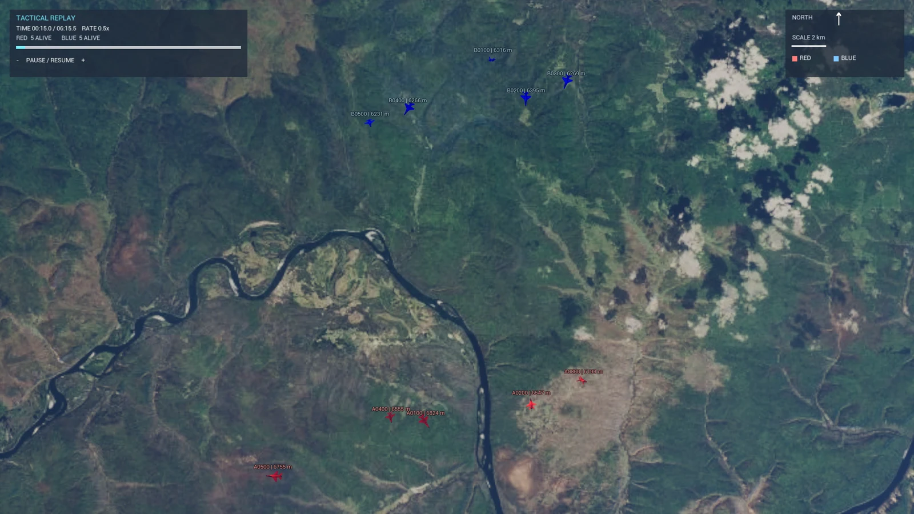
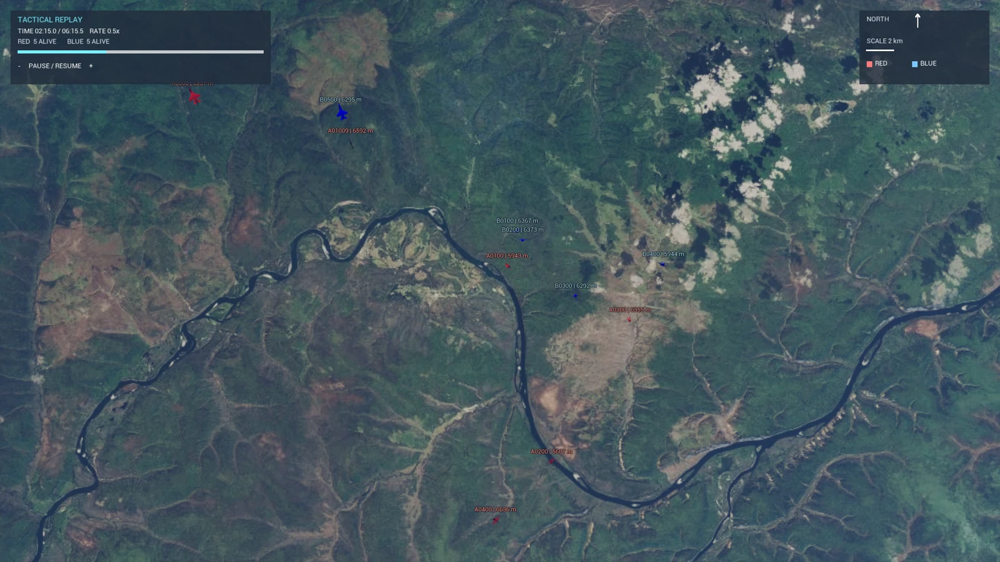
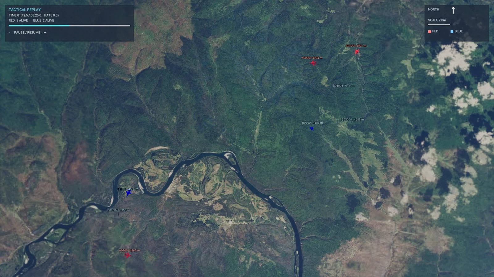

# AirCombatSim

基于 Unreal Engine 5.6 与 Cesium 的空战 ACMI 轨迹回放及离线视频生成系统，支持动态俯视镜头、战术 HUD、实体标签和 H.264 MP4 导出。

项目读取 Tacview ACMI 或 UE DataTable/CSV 轨迹，在真实地理环境中回放无人机、有人机和导弹运动，并可直接输出完整回合视频。

## 演示画面



| 多机交汇与动态俯视镜头 | 规则策略对抗中段态势 |
| --- | --- |
|  |  |

## 平台状态

| 能力 | Windows 10/11 | Linux |
| --- | --- | --- |
| UE 编辑器编译与交互回放 | 支持 | 支持，需要 UE 5.6 Linux 源码构建 |
| ACMI 转 CSV | 支持 | 支持，仅依赖 Python 标准库 |
| ACMI 一条命令生成 MP4 | 已端到端验证 | 暂无一键脚本，提供手动命令 |
| Cesium 地图 | 支持 | Cesium 插件支持，需正确安装 Linux 版本 |
| 离屏 FFmpeg 编码 | 已验证 | 代码路径支持，尚未在本项目 Linux 主机上端到端验证 |

项目默认地图为 `/Game/Untitled`，引擎版本固定为 UE 5.6。不要直接用其他大版本打开并保存资产；升级前应建立独立分支和完整备份。

## 主要功能

- 解析 Tacview 文本 ACMI，识别飞机、导弹、红蓝阵营、出生、消失与爆炸事件。
- 将不规则采样轨迹重采样为 UE 可直接读取的 CSV。
- 运行时直接加载本次生成的 CSV。
- 使用 Cesium 经纬高坐标定位实体并加载地形、卫星影像。
- 正北朝上的动态俯视镜头，以存活飞机的中心和范围自动调整焦点与高度。
- 原始飞机、导弹模型按目标像素尺寸缩放，远距离俯视时仍可辨认，不添加遮挡模型的标记物。
- 实体标签显示 ID 与高度；实体出现时显示、失活时同步隐藏。
- 战术 HUD 显示回放时间、倍率、进度、暂停控制、红蓝存活数、比例尺、北向箭头和图例。
- 点击实体可查看速度、航向、俯仰、阵营与状态。
- 离线确定性逐帧捕获；窗口实时刷新是否流畅不会影响最终视频时间轴。
- FFmpeg 直接接收 BGRA 帧并以 `libx264`、`preset slow`、`CRF 15` 编码，不默认写入 PNG 序列。
- 轨迹结束后输出约 2 秒黑屏并自动关闭导出进程。

当前演示视图主动关闭了轨迹尾迹；地面垂直投影、实体选择和爆炸效果仍由运行时逻辑管理。

## 目录结构

```text
AirCombatSim/
├─ AirCombatSim.uproject          # UE 5.6 项目入口
├─ LICENSE                        # 自主代码与文档的 Apache-2.0 许可证
├─ acmi_to_npy.py                 # ACMI -> UE CSV，名称为历史兼容保留
├─ Config/                        # 地图、渲染和输入配置
├─ Content/                       # 地图、蓝图、模型和 DataTable 资产
├─ Source/AirCombatSim/           # 回放、HUD、镜头、捕获与编码逻辑
├─ Tools/RenderAcmi.ps1           # Windows：ACMI 一键生成 MP4
├─ Tools/RenderRound.ps1          # Windows：导出已导入或指定 CSV 回合
└─ Saved/RoundRenders/            # 默认视频输出目录，不应提交到 Git
```

`Binaries/`、`DerivedDataCache/`、`Intermediate/`、`Saved/`、`.vs/` 和本地 Cesium 缓存均为生成内容，不属于项目源文件。

## 项目依赖

- Unreal Engine 5.6。
- 与 UE 5.6 匹配的 Cesium for Unreal。
- FFmpeg，必须包含 `libx264` 编码器。
- 可访问 Cesium ion 或项目所使用的其他 3D Tiles/影像服务。

ACMI 转换器仅使用 Python 标准库。Windows 一键脚本默认使用 UE 自带 Python。

## 获取源码

```bash
git clone https://github.com/m0feng/AirCombatReplay.git
cd AirCombatReplay
git lfs install
git lfs pull
```

## Windows 配置

### 1. 安装 UE 与编译工具

1. 通过 Epic Games Launcher 安装 Unreal Engine 5.6。
2. 安装 Visual Studio 2022 17.8 或更新版本。
3. 在 Visual Studio Installer 中启用 `Game development with C++`，并安装 MSVC、Windows 10/11 SDK 和 Unreal Engine 相关工具。
4. 安装与 UE 5.6 匹配的 Cesium for Unreal 插件。插件应能被 `AirCombatSim.uproject` 中的 `CesiumForUnreal` 条目发现。

本项目当前已验证的工具链为 Visual Studio 2022、MSVC 14.38 和 Windows SDK 10.0.22621.0。

设置本次 PowerShell 会话的引擎目录：

```powershell
$env:AIRCOMBAT_UE_ROOT = "Path"
```

### 2. 安装并验证 FFmpeg

安装 FFmpeg 后将其 `bin` 目录加入 `PATH`，然后检查：

```powershell
ffmpeg -version
ffmpeg -hide_banner -encoders | Select-String libx264
```

也可以不修改 `PATH`，运行脚本时使用：

```powershell
-FfmpegPath "Path"
```

### 3. 编译项目

先关闭 Unreal Editor，再在项目根目录运行：

```powershell
& "$env:AIRCOMBAT_UE_ROOT\Engine\Build\BatchFiles\Build.bat" `
  AirCombatSimEditor Win64 Development `
  "$PWD\AirCombatSim.uproject" -WaitMutex -NoHotReloadFromIDE
```

也可以直接执行后文的 `RenderAcmi.ps1`；它默认会先编译项目。

### 4. 配置 Cesium

打开项目和 `/Game/Untitled`，确认：

- Cesium for Unreal 插件已启用。
- `CesiumGeoreference` 和 Cesium 3D Tileset 能正常加载。
- Cesium ion token 或自定义数据源配置有效。
- 网络能够访问所使用的 Cesium/3D Tiles 服务。

## Windows 使用方法

### ACMI 一条命令生成 MP4

关闭 Unreal Editor，在项目根目录运行：

```powershell
powershell -ExecutionPolicy Bypass -File .\Tools\RenderAcmi.ps1 `
  -AcmiPath "Path" `
  -EngineRoot "$env:AIRCOMBAT_UE_ROOT"
```

脚本会依次完成：

1. 将 ACMI 转换为本次回放专用 CSV；
2. 编译 `AirCombatSimEditor`；
3. 启动 `/Game/Untitled`；
4. 在多个代表性镜头位置预热 Cesium；
5. 以固定时间步逐帧回放；
6. 将画面直接传给 FFmpeg；
7. 写入结尾黑屏并生成 MP4；
8. 成功后删除临时 CSV。

默认成片参数为 2560×1440、30 FPS、0.5 倍回放速度。输出位置：

```text
Saved/RoundRenders/<ACMI文件名>_<日期时间>/AirCombatRound.mp4
```

常用示例：

```powershell
# 0.75 倍速，保留转换后的 CSV
.\Tools\RenderAcmi.ps1 `
  -AcmiPath "Path" `
  -EngineRoot "$env:AIRCOMBAT_UE_ROOT" `
  -PlaybackRate 0.75 `
  -KeepCsv

# 已经编译，只重新导出；显示 UE 窗口
.\Tools\RenderAcmi.ps1 `
  -AcmiPath "Acmi Path" `
  -EngineRoot "$env:AIRCOMBAT_UE_ROOT" `
  -SkipBuild `
  -ShowWindow

# 指定 FFmpeg 和输出目录
.\Tools\RenderAcmi.ps1 `
  -AcmiPath "Acmi Path" `
  -EngineRoot "$env:AIRCOMBAT_UE_ROOT" `
  -FfmpegPath "Ffmpeg Path" `
  -OutputDirectory "Path"
```

主要参数：

| 参数 | 默认值 | 说明 |
| --- | ---: | --- |
| `-AcmiPath` | 必填 | 输入 `.acmi` 或 `.txt.acmi` 文件 |
| `-Fps` | `30` | 成片帧率，范围 1–120 |
| `-PlaybackRate` | `0.5` | 回放倍率，范围 0.25–4.0 |
| `-ReplayLimitSeconds` | `0` | 限制数据时间长度；0 表示完整回合 |
| `-Width` | `2560` | 输出宽度 |
| `-Height` | `1440` | 输出高度 |
| `-TargetDt` | `0.1` | ACMI 重采样时间间隔，单位秒 |
| `-SmoothingWindow` | `0` | 居中平滑窗口；0 表示关闭 |
| `-WarmupSeconds` | `8` | Cesium 最短预热时间 |
| `-MaxWarmupSeconds` | `90` | Cesium 最大预热时间 |
| `-EngineRoot` | 本机相关 | UE 5.6 根目录 |
| `-OutputDirectory` | 自动生成 | 视频输出目录 |
| `-FfmpegPath` | `ffmpeg` | FFmpeg 命令或完整路径 |
| `-SkipBuild` | 关闭 | 跳过 C++ 编译 |
| `-KeepCsv` | 关闭 | 成功后保留临时 CSV |
| `-ShowWindow` | 关闭 | 显示导出窗口；默认后台离屏运行 |
| `-KeepProxy` | 关闭 | 将当前代理环境变量传给 UE |
| `-PngSequence` | 关闭 | 使用旧 PNG 序列流程，会明显增加磁盘占用 |

视频中的数据播放时长约为 `ACMI 数据时长 ÷ PlaybackRate`，之后再加约 2 秒黑屏。例如 120 秒回合以 0.5 倍速输出时，视频约为 242 秒。

### 导出已经导入的回合

如果使用 `/Game/Data` 中已有的 DataTable：

```powershell
powershell -ExecutionPolicy Bypass -File .\Tools\RenderRound.ps1 `
  -EngineRoot "$env:AIRCOMBAT_UE_ROOT"
```

指定一个已经转换好的 CSV 目录：

```powershell
.\Tools\RenderRound.ps1 `
  -EngineRoot "$env:AIRCOMBAT_UE_ROOT" `
  -ReplayCsvDirectory ".\UE5_Split_Data" `
  -Width 2560 -Height 1440 -PlaybackRate 0.5
```

该目录必须包含 `Match_Manifest.csv` 以及清单中引用的轨迹文件。

### 交互回放

双击 `AirCombatSim.uproject`，打开 `/Game/Untitled` 并点击 Play。运行时可以：

- 点击 HUD 的 `-`、暂停/继续、`+` 按钮调整播放；倍率档位为 0.25、0.5、1、2、4。
- 点击实体查看详情，再点击空白区域取消选择。
- 查看固定像素大小的实体 ID/高度标签和红蓝存活数。

## Linux 配置

Linux 环境需要可运行 UE 5.6 Editor 的原生引擎构建。UE 5.6 对应 Ubuntu 22.04 或 Rocky Linux 8、clang 18.1.0，以及 v25 原生工具链。项目启用了 Vulkan SM6、Lumen、Nanite 和硬件光追；显卡和驱动需要满足相应 Vulkan 扩展要求。

### 1. 构建 Unreal Engine 5.6

完成 Epic 与 GitHub 账号关联并获取 UE 5.6 源码后，在引擎根目录运行：

```bash
./Setup.sh
./GenerateProjectFiles.sh
make -j$(nproc)
```

`Setup.sh` 会下载 Epic 固定的原生工具链。具体系统包、驱动和工具链版本以 Epic 的 UE 5.6 Linux 文档为准。

### 2. 安装 Cesium for Unreal

下载与 UE 5.6 匹配的 Cesium for Unreal Linux Release，或按照 Cesium 官方 Linux 开发说明自行构建。Linux 下引擎级插件应放在：

```text
<UE_ROOT>/Engine/Plugins/Marketplace/CesiumForUnreal/
```

不要放成 `<UE_ROOT>/Engine/Plugins/CesiumForUnreal`；Cesium 官方说明 Linux 的 Marketplace 子目录关系到插件 `.so` 的相对路径解析。

### 3. 安装运行依赖

安装 Python 3、FFmpeg、Git 和适配显卡的 Vulkan 驱动。确认：

```bash
python3 --version
ffmpeg -version
ffmpeg -hide_banner -encoders | grep libx264
vulkaninfo --summary
```

转换器不需要第三方 Python 包。

### 4. 编译项目

在项目根目录运行：

```bash
export AIRCOMBAT_UE_ROOT=/opt/UnrealEngine-5.6
export AIRCOMBAT_PROJECT_ROOT="$PWD"

"$AIRCOMBAT_UE_ROOT/Engine/Build/BatchFiles/Linux/Build.sh" \
  AirCombatSimEditor Linux Development \
  "$AIRCOMBAT_PROJECT_ROOT/AirCombatSim.uproject" -WaitMutex
```

交互打开项目：

```bash
"$AIRCOMBAT_UE_ROOT/Engine/Binaries/Linux/UnrealEditor" \
  "$AIRCOMBAT_PROJECT_ROOT/AirCombatSim.uproject" /Game/Untitled
```

首次打开后按 Windows 部分的要求检查 Cesium 数据源与 token。

## Linux 使用方法

### 转换并交互播放 ACMI

```bash
export AIRCOMBAT_ACMI=/data/round.acmi
export AIRCOMBAT_CSV="$AIRCOMBAT_PROJECT_ROOT/Saved/LinuxReplayCsv"

python3 acmi_to_npy.py \
  --path "$AIRCOMBAT_ACMI" \
  --output-dir "$AIRCOMBAT_CSV" \
  --target-dt 0.1

"$AIRCOMBAT_UE_ROOT/Engine/Binaries/Linux/UnrealEditor" \
  "$AIRCOMBAT_PROJECT_ROOT/AirCombatSim.uproject" /Game/Untitled \
  -game -windowed "-ReplayCsvDir=$AIRCOMBAT_CSV"
```

### 手动离屏生成 MP4

当前仓库的 `RenderAcmi.ps1` 和 `RenderRound.ps1` 使用 `Build.bat`、`Win64` 和 `UnrealEditor.exe`，不能在 Linux 直接运行。Linux 可使用下面的等价流程：

```bash
export AIRCOMBAT_ACMI=/data/round.acmi
export AIRCOMBAT_OUT="$AIRCOMBAT_PROJECT_ROOT/Saved/RoundRenders/Linux_$(date +%Y%m%d_%H%M%S)"
export AIRCOMBAT_CSV="$AIRCOMBAT_OUT/ReplayCsv"
export AIRCOMBAT_FFMPEG="$(command -v ffmpeg)"

mkdir -p "$AIRCOMBAT_CSV" "$AIRCOMBAT_OUT/Frames"

python3 acmi_to_npy.py \
  --path "$AIRCOMBAT_ACMI" \
  --output-dir "$AIRCOMBAT_CSV" \
  --target-dt 0.1

"$AIRCOMBAT_UE_ROOT/Engine/Binaries/Linux/UnrealEditor" \
  "$AIRCOMBAT_PROJECT_ROOT/AirCombatSim.uproject" /Game/Untitled \
  -game -windowed -ForceRes -ResX=2560 -ResY=1440 \
  -NoVSync -NoSplash -NoSound -unattended -RenderOffscreen \
  -AutoRecordRound -RecordFPS=30 -ReplayRate=0.5 \
  -RecordReplayLimit=0 -RecordWarmup=8 -RecordMaxWarmup=90 \
  "-ReplayCsvDir=$AIRCOMBAT_CSV" \
  "-RecordOutputDir=$AIRCOMBAT_OUT/Frames" \
  "-RecordFfmpeg=$AIRCOMBAT_FFMPEG" \
  "-RecordVideoFile=$AIRCOMBAT_OUT/AirCombatRound.mp4"
```

输出为：

```text
<AIRCOMBAT_OUT>/AirCombatRound.mp4
```

该流程需要可工作的 Vulkan 渲染上下文。无桌面的远程 GPU 主机可能还需要发行版、驱动和显示服务器相关配置。Linux 直接编码路径尚未在本项目维护者的 Linux 主机上端到端验证。

## ACMI 与 CSV 数据约定

转换器接受 Tacview 文本 ACMI，核心状态格式为：

```text
#<时间秒>
<ID>,T=<经度>|<纬度>|<高度>|<滚转>|<俯仰>|<航向>,Type=...,Color=...
-<ID>
```

单位：

- 经度、纬度：度。
- 高度：米。
- Roll、Pitch、Yaw：度。
- 时间：秒。

解析器支持元数据和 `T=` 状态分行更新；阵营优先读取 `Color`，也会根据 `Coalition` 中的 Blue/Red、Allies/Enemies 等常见值归一化。包含 `Weapon`、`Missile` 或 `AIM` 的类型映射为导弹，其余有效飞行对象默认映射为飞机。未在蓝图映射表中出现的标准 ACMI 类型会回退到项目原有 `BP_F16` 或 `BP_Missile`，不会创建替代模型。

转换输出：

```text
Match_Manifest.csv
Track_Plane_<ID>.csv
Track_Plane_Explosion_<ID>.csv
Track_Missile_<ID>.csv
Track_Missile_Explosion_<ID>.csv
```

清单列：

```text
ID,Category,Type,Team,TrackFile,ExplosionFile
```

轨迹列：

```text
FrameID,Time,Active,Lon,Lat,Alt,Roll,Pitch,Yaw
```

爆炸列：

```text
FrameID,Time,Explosion,Lon,Lat,Alt,Roll,Pitch,Yaw
```

`FrameID` 或 `ID` 是 UE DataTable 的行名列，不应再作为 `FTableRowBase` 的普通字段导入。

## 回放与渲染说明

- 镜头仅使用存活飞机计算取景中心和范围，导弹不会导致镜头突然大幅缩放。
- 最小取景宽度为 70,000 ft（约 21.3 km），安全边距为 18%。
- 相机首选距离限制为 12–130 km；若编队更宽，可为保证飞机不出画面而超过首选上限。
- 飞机目标屏幕尺寸约 56 px，导弹约 32 px；缩放作用于原始模型。
- 高质量导出使用 TSR、关闭运动模糊、固定曝光、轻微锐化，并降低 Cesium 屏幕空间误差。
- 标签是固定像素 HUD，直接跟随实体，不做会引发跳动的自动避让。
- 离线捕获使用固定时间步。导出窗口看起来卡顿或很慢属于正常现象，最终 MP4 仍按目标 FPS 均匀播放。

## LICENSE

本项目采用 [Apache License 2.0](LICENSE)。
